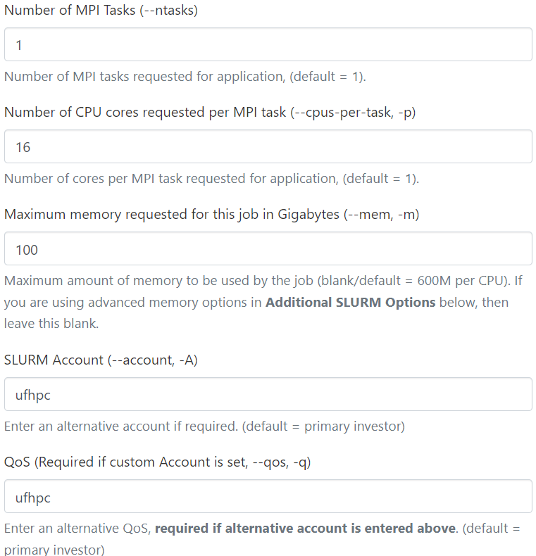
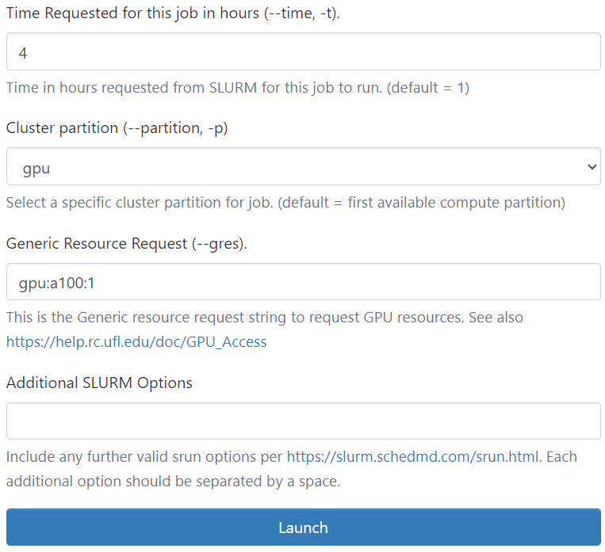

# DiffDock-NIM

Tutorial to run DiffDock NIM on HiPerGator

DiffDock is a state-of-the-art generative model used for drug discovery that predicts the three-dimensional structure of a protein-ligand complex, 
a crucial step in the drug discovery process. It predicts the binding structure of a small molecule ligand to a protein, 
known as molecular docking or pose prediction.

## Features

- Helps AI drug discovery pipelines and opens new research avenues for downstream task integrations.
- Highly accurate and computationally efficient
- Fast inference times and provides confidence estimates with high selective accuracy.


## Prerequisites

- **Hardware**:  
  Supported GPUs: Hopper (H100), Ampere (e.g., A100, A6000), Data Center GPUs (e.g., L40S), Volta (e.g., V100)  
  Minimum GPU memory: 16 GB  

- **Storage**:  
  Minimum driver version: 535.104.05  


## Launch DiffDock on HPG

1. Go to [OOD](https://ood.rc.ufl.edu/) and launch the Hipergator Desktop.
  <p align="center">
  
  
  </p>

   **Note**: Remember to update the SLURM account and QoS to match your group, and adjust the job time accordingly. 
   
2. Start a terminal and run the following commands:
   ```bash
   mkdir -p /blue/groupname/gatorlink/.cache/nim  # Run only the first time
   export LOCAL_NIM_CACHE=/blue/groupname/gatorlink/.cache/nim
   mkdir -p /blue/groupname/gatorlink/.cache/nim/workspace # Run only the first time
   export LOCAL_WORKSPACE=/blue/groupname/gatorlink/.cache/nim/workspace
   ml diffdock-nim
   diffdock
   start_server
   ```
3. Open a new terminal, use the following command to check the status of API until it returns `true`. This can take a couple of minutes.
   ```bash
   curl localhost:8000/v1/health/ready
   ```
---

## Running Inference

1. **Open a New Terminal**  
   Keep the original terminal running with the launched service.

2. **Navigate to your DESIRED job running directory**
   ```bash
   cd /blue/groupname/gatorlink/...
   ```

3. **Prepare JSON formatted post-data. **  
   This step requires being launched in the most common bash shell environment in Linux. Users can verify if the current session is bash by using the command echo $0.
   If not, run the command /bin/bash before this step.
   ```bash
   protein_bytes=`curl https://files.rcsb.org/download/8G43.pdb | grep -E '^ATOM' | sed -z 's/\n/\\\n/g'`; \
   ligand_bytes=`curl https://files.rcsb.org/ligands/download/ZU6_ideal.sdf | sed -z 's/\n/\\\n/g'`; \
   echo "{
   \"ligand\": \"${ligand_bytes}\",
   \"ligand_file_type\": \"sdf\",
   \"protein\": \"${protein_bytes}\",
   \"num_poses\": 1,
   \"time_divisions\": 20,
   \"steps\": 18,
   \"save_trajectory\": false,
   \"is_staged\": false
   }" > diffdock.json
   ```

4. **Run Inference and save to output.json.**  
   ```bash
   curl --header "Content-Type: application/json" \
    --request POST \
    --data @diffdock.json \
    --output output.json \
    http://localhost:8000/molecular-docking/diffdock/generate
   ```

5. **View the Outputs**  
   The output file output.json is a JSON formatted content with predicted docking poses (coordinates of ligand atoms) with the structure below:
   | Field                | Type            | Description                                                                                   |
   |----------------------|-----------------|-----------------------------------------------------------------------------------------------|
   | `status`              | `str`           | Report `success` or `fail` for this request                                                  |
   | `ligand_positions`    | `list of str`   | List of SDF formatted text as the generated poses                                            |
   | `position_confidence` | `list of float` | List of confidence scores for the generated poses                                            |
   | `trajectory`          | `list of str`   | List of PDB formatted text as the diffusion trajectories for the generated poses (optional)  |

---

## Dump Generated Poses

1. A simple Python script provided in this section is used to dump the inference results (docked poses of ligands) into a folder named as output.
   Create a new blank file, name it as dump_output.py and copy the content below into it.
   ```python
   import json
   import os
   import shutil

   def dump_one(folder, ligand_positions, position_confidence):
       os.makedirs(folder, exist_ok=True)

       for i, c in enumerate(position_confidence):
          with open('%s/rank%02d_confidence_%0.2f.sdf' % (folder, i+1, c), 'w') as f:
              f.write(ligand_positions[i])

   shutil.rmtree('output', ignore_errors=True)
   os.makedirs('output', exist_ok=True)

   with open('output.json') as f:
       data = json.load(f)

   if type(data['status']) == str:
       dump_one('output', data['ligand_positions'], data['position_confidence'])
   else:
       for i in range(len(data['status'])):
           dump_one('output/ligand%d' % (i+1), data['ligand_positions'][i], data['position_confidence'][i])
   ```

2. Run the command below to launch the Python script.
   ```bash
   python3 dump_output.py
   ```

3. List the content in the output folder.
   ```bash
   $ ls output
   rank01_confidence_-0.82.sdf
   ```

---

## Advanced Usage

### Run Inference with Bash Script

In this example, we create a simple `bash` script to launch inference using two local files as input and dump the generated poses in the `output` folder.

1. Create a new blank file in the same folder, name it as `diffdock.sh` and copy the content below into it.
   ```bash
   #!/bin/bash

   # Script: diffdock.sh - Run inference using local files as input
   # Usage: ./diffdock.sh [receptor].pdb [ligand].sdf

   protein_file=$1
   ligand_file=$2

   protein_bytes=`grep -E ^ATOM $protein_file | sed -z 's/\n/\\\n/g'`
   ligand_bytes=`sed -z 's/\n/\\\n/g' $ligand_file`
   ligand_format=`basename $ligand_file | awk -F. '{print $NF}'`

   echo "{
   \"ligand\": \"${ligand_bytes}\",
   \"ligand_file_type\": \"${ligand_format}\",
   \"protein\": \"${protein_bytes}\",
   \"num_poses\": 10,
   \"time_divisions\": 20,
   \"steps\": 18,
   \"save_trajectory\": false,
   \"is_staged\": false
   }" > diffdock.json

   curl --header "Content-Type: application/json" \
      --request POST \
      --data @diffdock.json \
      --output output.json \
      http://localhost:8000/molecular-docking/diffdock/generate
   ```
2. Make the script executable.
   ```bash
   chmod +x diffdock.sh
   ```

3. Download the input files from RCSB database and launch the inference.
   ```bash
   curl -o 8G43.pdb https://files.rcsb.org/download/8G43.pdb
   curl -o ZU6.sdf https://files.rcsb.org/ligands/download/ZU6_ideal.sdf
   ./diffdock.sh 8G43.pdb ZU6.sdf
   ```
4. Dump the output using the python script created in Getting Started.
   ```bash
   python3 dump_output.py
   ls output1
   ```
5. Example of output
   ```bash
   rank01_confidence_0.52.sdf   rank06_confidence_-0.54.sdf
   rank02_confidence_0.31.sdf   rank07_confidence_-0.56.sdf
   rank03_confidence_-0.03.sdf  rank08_confidence_-0.65.sdf
   rank04_confidence_-0.04.sdf  rank09_confidence_-1.04.sdf
   rank05_confidence_-0.41.sdf  rank10_confidence_-1.54.sdf
   ```

### Run Inference for Batch-Docking
DiffDock NIM allows for a **Batch-Docking** mode, which docks a group of ligand molecules against the same protein receptor through a single inference request if a multi-molecule SDF file is submitted in this request.
Batch-docking mode is much more efficient than running separate inference requests. The example below illustrates batch-docking using a protein PDB file with five molecule SDF files downloaded from **RSCB**.
1. Prepare the SDF input file with multiple ligand molecules. Create a new blank file, name it as `make-multiligand.sh`, and copy the content below into it.
   ```bash
   #!/bin/bash

   # Script: make-multiligand.sh
   # Usage: ./make-multiligand.sh [Ligand1_CCD_ID] [Ligand2_CCD_ID] ...
   # Example: ./make-multiligand.sh COM Q4H QPK R4W SIN

   ligand_files=""

   for lig in $*
   do
       ligand_file=${lig}.sdf
       echo "Download ligand file:${ligand_file}"
       curl -o $ligand_file "https://files.rcsb.org/ligands/download/${lig}_ideal.sdf"
       ligand_files="${ligand_files}${ligand_file}"
   done

   # Combine ligand files into a single SDF file
   cat $ligand_files > multi_ligands.sdf
   ```

2. Run the commands below to generate the `multi_ligands.sdf` for input.
   ```bash
   chmod +x make-multiligand.sh
   ./make-multiligand.sh COM Q4H QPK R4W SIN
   ```

3. Download the protein PDB file and launch the inference.
   ```bash
   curl -o 7RWO.pdb "https://files.rcsb.org/download/7RWO.pdb"
   ./diffdock.sh 7RWO.pdb multi_ligands.sdf
   ```

4. Dump the result and an example of output is below.
   ```bash
   python3 dump_output.py
   ls output/*

   diffdock-output/ligand0:
   rank01_confidence_-0.74.sdf  rank05_confidence_-1.15.sdf  rank09_confidence_-1.55.sdf
   rank02_confidence_-0.92.sdf  rank06_confidence_-1.25.sdf  rank10_confidence_-1.93.sdf
   rank03_confidence_-0.93.sdf  rank07_confidence_-1.46.sdf
   rank04_confidence_-1.04.sdf  rank08_confidence_-1.46.sdf

   diffdock-output/ligand1:
   rank01_confidence_-0.25.sdf  rank05_confidence_-0.55.sdf  rank09_confidence_-0.72.sdf
   rank02_confidence_-0.28.sdf  rank06_confidence_-0.55.sdf  rank10_confidence_-0.77.sdf
   rank03_confidence_-0.34.sdf  rank07_confidence_-0.56.sdf
   rank04_confidence_-0.49.sdf  rank08_confidence_-0.57.sdf
   
   ...
   ```

### Batch-Docking using SMILES
Besides the SDF format for ligand molecules, DiffDock also support **SMILES** text strings as the input. DiffDock uses **RDKit** to generate random molecular conformers from the SMILES information. 
A plain text file can be used as the ligand input with multiple lines, each of which is a SMILES formula representing a molecule, to conduct batch-docking.
1. Create a new blank file, name it as `ligands.txt` and copy the content below into it.
   ```bash
   Cc1cc(F)c(NC(=O)NCCC(C)(C)C)cc1Nc1ccc2ncn(C)c(=O)c2c1F
   COc1cccc(NC(=O)c2ccc(C)c(Nc3nc(-c4cccnc4)nc4c3cnn4C)c2)c1
   Cc1nn(C)c(C)c1CCOc1cc(F)ccc1-c1ccc2n[nH]c(CN(C)C)c2c1
   Cc1c(C(=O)c2cccc3ccccc23)c2cccc3c2n1[C@H](CN1CCOCC1)CO3
   ```

2. Run the commands below to invoke the DiffDock model. The script generates an input JSON file and returns the inference result in JSON format in the file output.json.
   ```bash
   ./diffdock.sh 8G43.pdb ligands.txt
   ```

3. Dump the result and check the output folder.
   ```bash
   $ python3 dump_output.py
   $ ls output/*

   diffdock-output/ligand0:
   rank01_confidence_-0.98.sdf  rank05_confidence_-1.30.sdf  rank09_confidence_-1.77.sdf
   rank02_confidence_-1.00.sdf  rank06_confidence_-1.36.sdf  rank10_confidence_-2.27.sdf
   rank03_confidence_-1.03.sdf  rank07_confidence_-1.58.sdf
   rank04_confidence_-1.21.sdf  rank08_confidence_-1.61.sdf

   diffdock-output/ligand1:
   rank01_confidence_-0.15.sdf  rank05_confidence_-1.25.sdf  rank09_confidence_-1.55.sdf
   rank02_confidence_-0.54.sdf  rank06_confidence_-1.29.sdf  rank10_confidence_-1.66.sdf
   rank03_confidence_-0.91.sdf  rank07_confidence_-1.38.sdf
   rank04_confidence_-1.03.sdf  rank08_confidence_-1.39.sdf
   
   ...
   ```
---

## Stopping the NIM Service

To stop the NIM service, simply close the terminal window.

### Important Note
It is recommended to **clean your cache and workspace files** every time you stop the server to ensure it won't affect your next run. You can do this by removing the cache directory:
```bash
rm -r /blue/groupname/gatorlink/.cache/nim/ngc
rm -rf /blue/groupname/gatorlink/.cache/nim/workspace/*
```

---

## Another way to run DiffDock NIM on HPG

1. **Submit a SLURM batch job**  
   Use `sbatch` to start the NIM server with GPU resources, and record the name of the node where the server is running.

2. **Open a terminal to run inference**  
   Start an SSH terminal on the same node as the server to run inference.
   ```bash
   ssh node_name
   ```

---

## References

- [DiffDock Documentation](https://docs.nvidia.com/nim/bionemo/diffdock/latest/index.html)
- [Diffdock on NVIDIA NGC](https://catalog.ngc.nvidia.com/orgs/nim/teams/mit/containers/diffdock)
